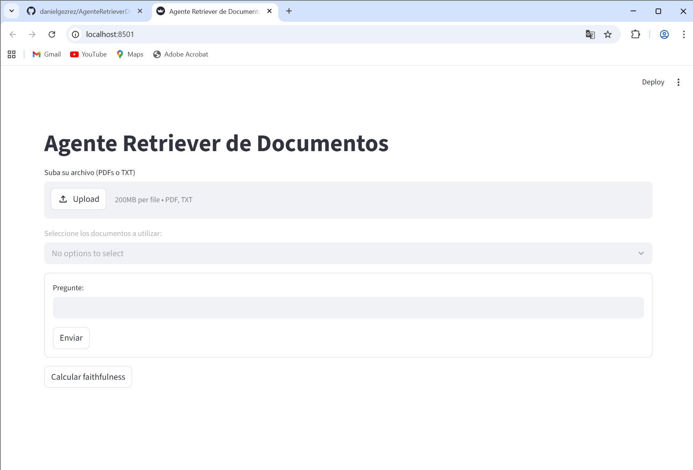
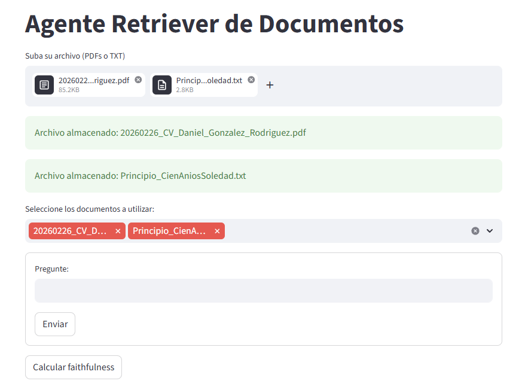
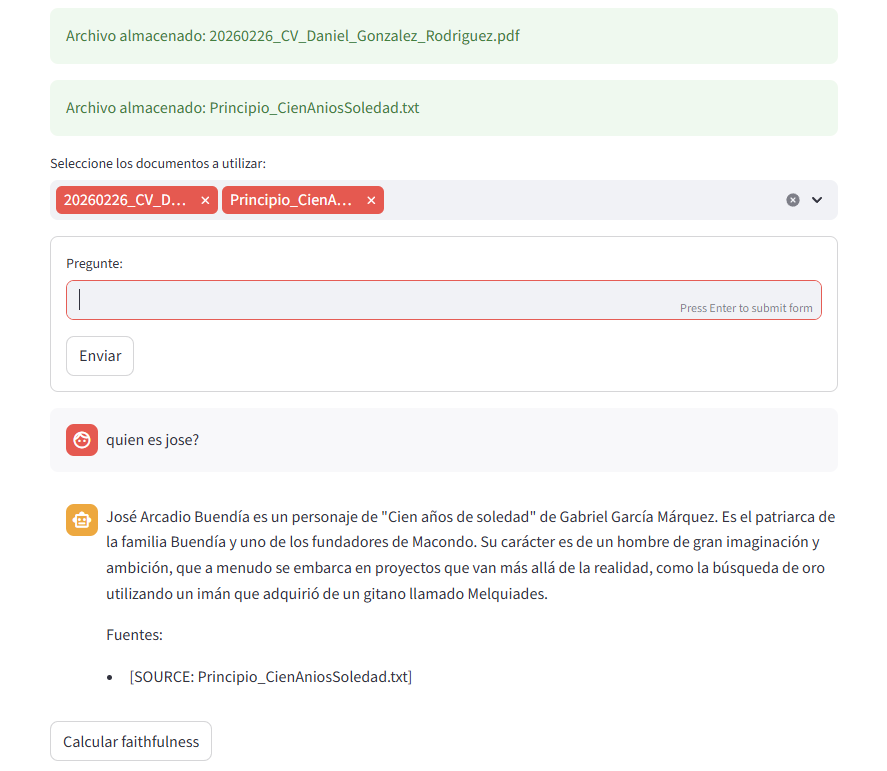
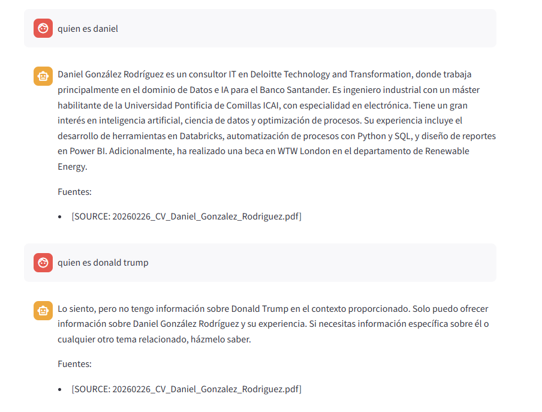
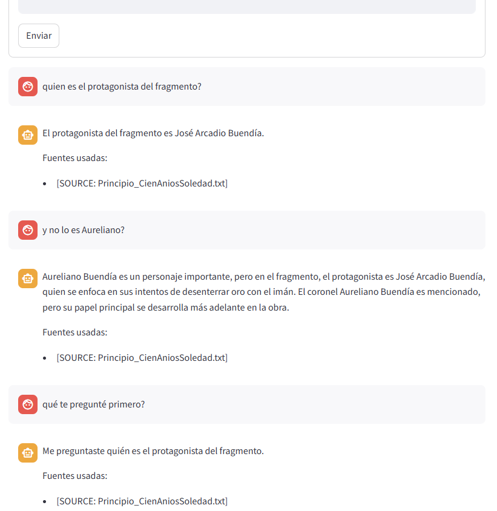
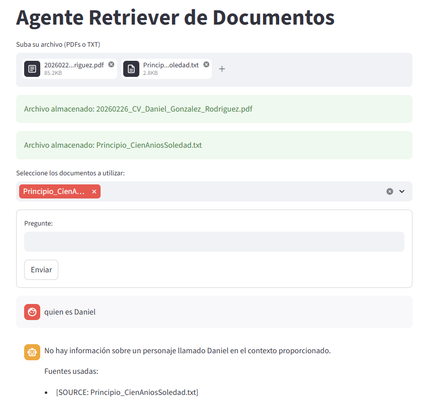
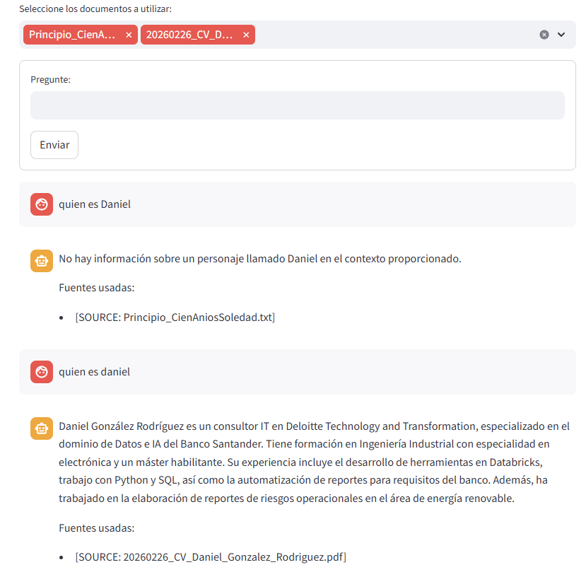
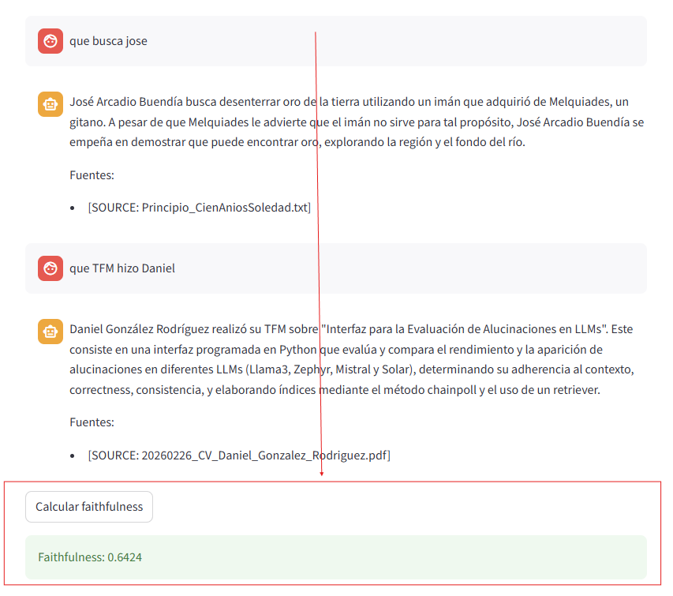

# **Arquitectura y decisiones de diseño**

Proyecto con nombre AgenteRetrieverDocumentos que tiene:

Primer nivel:
* app.py (front programado con streamlit)
* requerimientos.txt (dependencias que se deben tener instaladas para el funcionamiento correcto)
* .env (crearlo como se indica en las instrucciones de instalación y ejecución)

Carpeta principal:
* config.py (configuracion de la info del archivo .env)
* lector_documentos.py (funciones para extraer el texto de los documentos y separarlo en fragmentos del mismo tamaño)
* almacen_documentos.py (Clase VectorStore que almacena los textos y utiliza faiss L2 para encontrar fragmentos con mayor similitud a la peticion del usuario)
* agente.py (Clase Agente RAG mediante el uso de semantic kernel y la API de OpenAI)

Carpeta plugins:
* summary_plugins.py (plugin nativo de semantic kernel para resumir la respuesta)

Principales decisiones de diseño:
* Diseño modular buscando separación de responsabilidades.
* Streamlit para el front: Porque lo había utilizado en otras ocasiones y sabía que da resultados rápido.
* OpenAI como proveedor utilizando la API key para tener acceso simple tanto a modelos LLM como de generación de embeddings.
* FAISS para el vector store: Porque no requiere de otra API y da buen rendimiento en local.
* Se organiza el proyecto en un primer nivel simple (app.py, requirements.txt, .env) para facilitar ejecución, configuración y despliegue rápido.
* La lógica se centraliza en una carpeta principal: configuración (config.py), ingesta de documentos (lector_documentos.py), almacenamiento vectorial (almacen_documentos.py) y el agente RAG (agente.py).
* Se añade una carpeta plugins para funcionalidades adicionales del agente, facilitando la ampliación del sistema sin modificar el núcleo.

Requisitos opcionales cumplidos:
* Posibilidad de filtrar la búsqueda por los documentos concretos elegidos por el usuario.
* Posibilidad de que el usuario, despues de haber realizado multiples preguntas, pulse en un boton para imprimir en pantalla la metrica faithfulness; calculada como la media de la similitud coseno entre las respuestas recibidas y los fragmentos utilizados para generar las mismas.

# **Instrucciones de instalación y ejecución**

1. Crear archivo ".env" con ese nombre y que incluya:

OPENAI_API_KEY=                                  <- poner la key de la API de OpenAI

OPENAI_CHAT_MODEL=gpt-4o-mini                    <- poner el LLM de OpenAI deseado

OPENAI_EMBEDDING_MODEL=text-embedding-3-small    <- poner el modelo de embeddings de OpenAI deseado

2. Instalar todas las dependencias del archivo requerimientos.txt: pip install -r requerimientos.txt

3. Ejecutar: streamlit run app.py

# **Capturas de la aplicación en funcionamiento con al menos un documento de ejemplo**

1. Interfaz en el inicio:

2. Interfaz tras cargar un .txt (el principio de la novela Cien Años de Soledad) y un .pdf (mi CV):

3. Primera pregunta sobre el contexto del txt. Además de la respuesta, se imprime que la fuente utilizada para responder es la correcta.

4. Segunda pregunta sobre el contexto del pdf también funciona. Por otro lado, si se pregunta por algo ajeno al contexto, la respuesta impresa en pantalla es que no tiene información disponible.

5. Ejemplo que demuestra que el chat tiene memoria del historial de chat anterior:

6. Ampliación 1: Dos capturas sobre cómo el usuario puede filtrar los archivos cargados para que el modelo pueda contestar solo de los seleccionados.
* Los dos archivos subidos y solo uno seleccionado, al preguntar por el otro archivo, el agente no sabe responder.

* Pasa a seleccionarse también el archivo en cuestión y se realiza la misma pregunta; ahora sí, recibiendo respuesta.

7. Ampliación 2: Posibilidad de que el usuario, tras haber realizado varias preguntas, muestre la métrica faithfulness en pantalla. Es calculada como la media de las similitudes de cada respuesta con los fragmentos utilizados para generar la misma.

# **Qué mejoraría con más tiempo**
- Mejora de la interfaz, incluyendo colocar la caja de prompts debajo del chat en vez de encima.
- Que el historial del chat no se utilice dentro del prompt engineering, sino pasado como argumento al kernel. Esto ha sido probado pero mostraba peores resultados que el prompt engineering, por lo que se optó por mantenerlo como parte del prompt.
- Mejora de display de errores (error al enviar prompt sin haber subido archivos antes).
- Que no imprima un 'contexto' por pantalla si no ha sido capaz de utilizar ninguno y su respuesta es tan solo 'No tengo informacion disponible'.
- Mayor investigación para que el chat responda mejor a preguntas que requieran utilizar información de varios de los documentos simultáneamente.
- Ampliación de plugins en summary_plugin.py.
