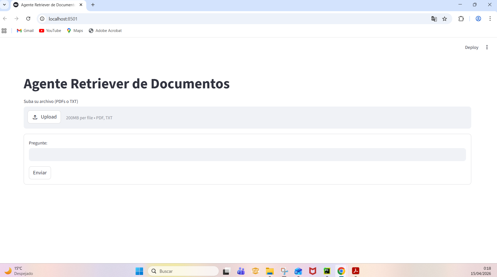
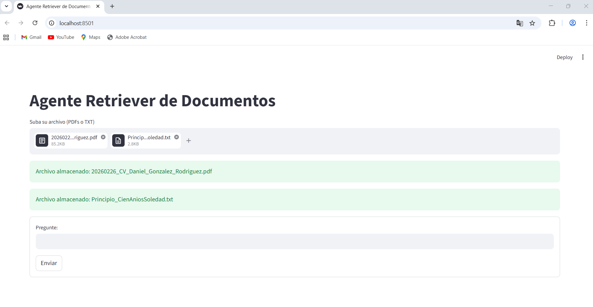
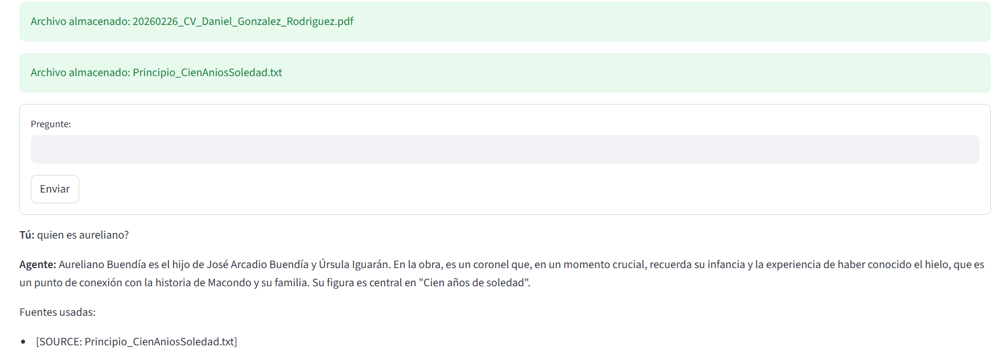
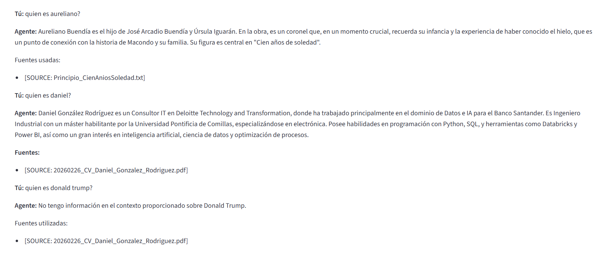
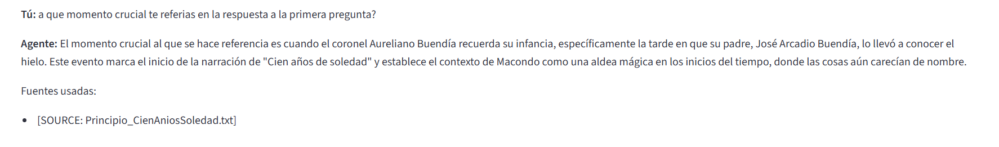

# **Arquitectura y decisiones de diseño**

Proyecto con nombre AgenteRetrieverDocumentos que tiene:

Primer nivel:
* app.py (front programado con streamlit)
* requerimientos.txt (dependencias que se deben tener instaladas para el funcionamiento correcto)
* .env (crearlo como se indica en las instrucciones de instalación y ejecución)

Carpeta principal:
* config.py (configuracion de la info del archivo .env)
* lector_documentos.py (funciones para extraer el texto de los documentos y separarlo en fragmentos del mismo tamaño)
* almacen_documentos.py (Clase VectorStore que almacena los textos y utiliza faiss L2 para encontrar fragmentos con mayor similitud a la peticion del usuario)
* agente.py (Clase Agente RAG mediante el uso de semantic kernel y la API de OpenAI)

Carpeta plugins:
* summary_plugins.py (plugin nativo de semantic kernel para resumir la respuesta)

Principales decisiones de diseño:
* Diseño modular buscando separación de responsabilidades.
* Streamlit para el front: Porque da resultados rápido y lo había utilizado en otras ocasiones.
* Se organiza el proyecto en un primer nivel simple (app.py, requirements.txt, .env) para facilitar ejecución, configuración y despliegue rápido.
* La lógica se centraliza en una carpeta principal: configuración (config.py), ingesta de documentos (lector_documentos.py), almacenamiento vectorial (almacen_documentos.py) y el agente RAG (agente.py).
* Se añade una carpeta plugins para funcionalidades adicionales del agente, facilitando la ampliación del sistema sin modificar el núcleo.

# **Instrucciones de instalación y ejecución**

1. Crear archivo ".env" con ese nombre y que incluya:

OPENAI_API_KEY=                                  <- poner la key de la API de OpenAI

OPENAI_CHAT_MODEL=gpt-4o-mini                    <- poner el LLM de OpenAI deseado

OPENAI_EMBEDDING_MODEL=text-embedding-3-small    <- poner el modelo de embeddings de OpenAI deseado

2. Instalar todas las dependencias del archivo requerimientos.txt: pip install -r requerimientos.txt

3. Ejecutar: streamlit run app.py

# **Capturas de la aplicación en funcionamiento con al menos un documento de ejemplo.**

1. Interfaz en el inicio:

2. Interfaz tras cargar un .txt (el principio de la novela Cien Años de Soledad) y un .pdf (mi CV):

3. Primera pregunta sobre el contexto del txt. Además de la respuesta, se imprime que la fuente utilizada para responder es la correcta.

4. Segunda pregunta sobre el contexto del pdf también funciona. Por otro lado, si se pregunta por algo ajeno al contexto la respuesta impresa en pantalla es que no tiene información disponible en el contexto.

5. Ejemplo que demuestra que el chat tiene memoria del contexto anterior:

# **Qué mejorarías con más tiempo**
- Mayor investigación para que el chat responda bien a preguntas que requieran utilizar información de varios de los documentos simultáneamente.
- Mejora de la interfaz, incluyendo colocar la caja de texto debajo del chat.
- Mejora de display de errores.
- Que no imprima un 'contexto' por pantalla si no ha sido capaz de utilizar ninguno y su respuesta es tan solo 'No tengo informacion disponible'.
- Ampliación de plugins en summary_plugin.py.
